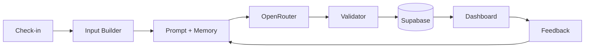

# CampusFin AI

**CampusFin AI is an AI operating assistant that helps campus merchants make one practical operating decision every day.**

Campus-area coffee shops, bubble tea stores, and print shops open CampusFin for 3–5 minutes daily: record revenue and customers, receive one campus-aware operating action, and optionally rate whether it helped. No chatbot. No reports. One decision.

---

## Project Overview

| | |
|---|---|
| **Problem** | Campus merchants lack data-driven daily operating decisions |
| **Solution** | Campus context + business health + goal + memory + feedback → **one action** |
| **Moat** | Campus-first reasoning (exam week, career fairs, rain, graduation) |
| **MVP status** | Feature complete — check-in, AI recommendations, feedback loop, learning timeline |

**Full product story:** [docs/PRODUCT-OVERVIEW.md](./docs/PRODUCT-OVERVIEW.md)

---

## Architecture

```
app/              Next.js routes (Dashboard, Check-in, Auth)
lib/ai/           Prompt, LLM, Validator, Memory, Presentation, Learning
components/       Dashboard UI (4 zones + Decision card + Learning card)
supabase/         Postgres schema, migrations, RPC
scripts/          Eval runner + AI Judge
testcases/        12 eval scenarios
```

**Detailed map:** [docs/ARCHITECTURE.md](./docs/ARCHITECTURE.md)

---

## AI Pipeline



**Full workflow:** [docs/AI-WORKFLOW.md](./docs/AI-WORKFLOW.md)

---

## Demo Screenshots

> Placeholder — add PNGs to `docs/assets/` when captured.

| Screenshot | Description |
|------------|-------------|
|  | Full Dashboard |
|  | Explainable decision card |
|  | CampusFin Learning |
|  | Owner feedback modal |

See [docs/assets/README.md](./docs/assets/README.md) for capture instructions.

**3-minute demo script:** [docs/DEMO-SCRIPT.md](./docs/DEMO-SCRIPT.md)

---

## How to Run

### Prerequisites

- Node.js 20+
- Supabase project (apply migrations in `supabase/migrations/`)
- Optional: OpenRouter API key for live LLM

### Setup

```bash
git clone <repo-url>
cd CampusFin-AI
npm install
cp .env.example .env.local
# Fill in Supabase URL + anon key
npm run dev
```

Open [http://localhost:3000](http://localhost:3000) → Sign up → Setup business → Daily Check-in → Dashboard.

### Commands

| Command | Purpose |
|---------|---------|
| `npm run dev` | Development server |
| `npm run build` | Production build |
| `npm run eval` | Run 12-scenario AI eval (requires `LLM_API_KEY`) |

---

## Environment Variables

| Variable | Required | Description |
|----------|----------|-------------|
| `NEXT_PUBLIC_SUPABASE_URL` | Yes | Supabase project URL |
| `NEXT_PUBLIC_SUPABASE_ANON_KEY` | Yes | Supabase anon key |
| `NEXT_PUBLIC_SITE_URL` | Yes | App URL for auth redirects |
| `ENABLE_LLM` | No | `true` to enable LLM (default: rule-based) |
| `LLM_PROVIDER` | No | `openrouter` (default) |
| `LLM_API_KEY` | If LLM | OpenRouter or OpenAI API key |
| `LLM_MODEL` | No | e.g. `openai/gpt-4o-mini` |
| `LLM_BASE_URL` | No | Default: `https://openrouter.ai/api/v1` |

See [.env.example](./.env.example) for full list.

---

## Documentation

| Doc | Description |
|-----|-------------|
| [PRODUCT-OVERVIEW.md](./docs/PRODUCT-OVERVIEW.md) | Product story (3-min read) |
| [AI-WORKFLOW.md](./docs/AI-WORKFLOW.md) | Pipeline flowchart |
| [DEMO-SCRIPT.md](./docs/DEMO-SCRIPT.md) | Founder demo script |
| [PORTFOLIO-HIGHLIGHTS.md](./docs/PORTFOLIO-HIGHLIGHTS.md) | AI-native portfolio story |
| [ARCHITECTURE.md](./docs/ARCHITECTURE.md) | Folder structure |
| [AI-ENGINE.md](./docs/AI-ENGINE.md) | AI implementation |
| [DATABASE.md](./docs/DATABASE.md) | Schema reference |

---

## Future Roadmap

| Phase | Focus |
|-------|-------|
| **Beta** | Onboard 5–10 campus merchants, collect feedback quality data |
| **Learning v2** | Stronger preference signals from repeated feedback patterns |
| **Campus data** | Richer event ingestion (API / manual admin) |
| **Multi-location** | One owner, multiple shops |
| **Analytics** | Recommendation acceptance rate, action_type effectiveness |
| **Mobile** | PWA or native wrapper for daily check-in speed |

See [docs/ROADMAP.md](./docs/ROADMAP.md) for full backlog.

---

## Tech Stack

Next.js · TypeScript · Supabase · OpenRouter · Tailwind CSS · Vercel

---

## License

Private — MVP demo / portfolio use.
