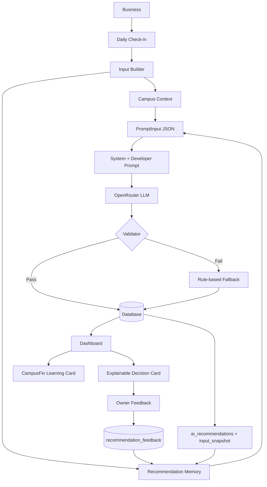

# CampusFin AI — Workflow

Complete pipeline from business data to learning memory. No step requires user-facing chat.

---

## End-to-end flow



---

## Step-by-step

| Step | Component | What happens |
|------|-----------|--------------|
| 1 | **Business** | Owner profile, campus, goal, timezone |
| 2 | **Daily Check-in** | Revenue, customers, optional note saved to `daily_checkins` |
| 3 | **Input Builder** | `buildPromptInput()` assembles structured JSON |
| 4 | **Campus Context** | Events, moment, traffic forecast, headline |
| 5 | **Recommendation Memory** | Last 7 prior recommendations + feedback → `recommendation_memory` |
| 6 | **Prompt** | System + Developer prompt + few-shots + PromptInput |
| 7 | **OpenRouter** | `generateRecommendation()` — OpenAI-compatible chat completion |
| 8 | **Validator** | Schema, Chinese text, campus reference, 30-minute rule |
| 9 | **Database** | `upsert_ai_recommendation` RPC stores result + `input_snapshot` |
| 10 | **Dashboard** | Zone 1–4 + Today's Priority + CampusFin Learning |
| 11 | **Owner Feedback** | `submitRecommendationFeedback()` — no page refresh |
| 12 | **Memory** | Next day's prompt reads prior feedback via `loadRecommendationMemory()` |

---

## Fallback path

When `ENABLE_LLM=false`, LLM fails, or validation fails twice:

```
Check-in → Input Builder → Rule-based Engine → Database → Dashboard
```

User sees a valid recommendation. `source = rule_based` and `fallback_reason` stored in `input_snapshot` for debugging.

---

## Presentation layer (no LLM)

After storage, the Dashboard derives UI copy locally:

| Module | File | Purpose |
|--------|------|---------|
| Decision card | `lib/ai/presentation.ts` | Signals, why-this-action, badges |
| Learning card | `lib/ai/learning.ts` | Timeline, learned text, progress |

These modules read `input_snapshot` and existing DB rows only.

---

## Quality loop (offline)

```
testcases/*.json → eval.ts → Generate → Validator → AI Judge → reports/evaluation-report.md
```

Used for prompt regression testing — not part of production user flow.

---

## Related docs

- [AI Engine](./AI-ENGINE.md) — implementation details
- [AI Prompts](./AI-PROMPTS.md) — prompt architecture
- [Architecture](./ARCHITECTURE.md) — code layout
